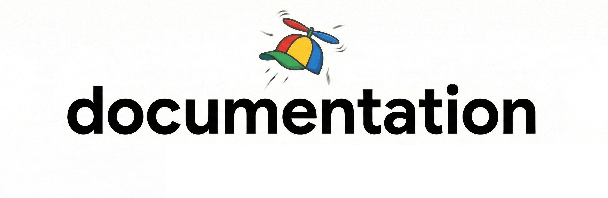

# Alter Docs Community Skill

This repository contains a community Skill for Alter documentation support.

- Keep `SKILL.md` short and activation-focused.
- Store reusable reference content in `references/`.
- Store practical content in `how-to/`, `guides/`, and `use-cases/`.
- Track recurring support problems in `common-issues/`.
- Keep media bundled in this repo under `assets/`.
- Preserve imported source material in `references/`.

When rendered publicly, bundled media should be referenced as:

- `https://alterhq.com/assets-doc/...`

where `assets-doc` maps to the local `assets/` directory.

## Repository Layout

- `SKILL.md`: skill entrypoint and routing rules
- `references/`: canonical references (FAQ, docs map, image library)
- `how-to/`: short task-based instructions
- `guides/`: detailed walkthroughs
- `use-cases/`: scenario-based examples
- `common-issues/`: known problems and fixes
- `assets/images/`: bundled screenshots/GIFs/WEBP files
- `scripts/`: validation and asset tooling
- `references/temp-docs-source.md`: imported source snapshot used to kickstart this repo

The source document `temp-docs.md` is preserved and split into topic files under `guides/`, `references/`, and `how-to/`.

## Contributing

Contributors are very welcome. Community additions are encouraged as long as content is accurate, practical, and easy to verify.

AI-assisted writing is welcome, but it must be fact-checked and edited for clarity. Please avoid low-signal AI slop: submissions should be concise, digestible, and genuinely useful for the community.

If you are contributing with an AI agent, use `ALTER.md` as the guideline source of truth before making changes.

1. Pick the right folder:
   - `how-to/` for direct "How do I do X?"
   - `guides/` for complete tutorials
   - `use-cases/` for real workflow scenarios
   - `common-issues/` for known issue + resolution entries
2. Start from templates:
   - `how-to/_TEMPLATE.md`
   - `guides/_TEMPLATE.md`
   - `use-cases/_TEMPLATE.md`
   - `common-issues/_TEMPLATE.md`
3. Add or update assets in `assets/images/...`.
4. Reference assets with `https://alterhq.com/assets-doc/images/...` URLs.
5. You can include relevant external resources such as social posts, YouTube videos, and personal blog articles when they add clear value.
6. Run checks before opening a PR.

### Commit Convention

Use [Conventional Commits](https://www.conventionalcommits.org/) for all commit messages.

Examples:

- `docs(guides): add url callbacks guide`
- `chore(ci): validate assets-doc mapping on pull requests`
- `fix(references): correct pricing faq fair-use wording`

## Scripts

All scripts are Python 3 and require only the standard library.

- `python3 scripts/check_links.py`
  - validates markdown links and local references
- `python3 scripts/check_assets.py`
  - validates `/assets-doc/` URL mapping to local `assets/`
  - can report orphaned assets
- `python3 scripts/download_assets.py --manifest assets/manifest.csv`
  - downloads remote assets into local `assets/`

Optional flags:

- `python3 scripts/check_links.py --check-external`
- `python3 scripts/check_links.py --check-external-media`
- `python3 scripts/check_assets.py --fail-on-orphans`

## CI on Pull Requests

GitHub Actions runs `.github/workflows/validate-media-and-assets.yml` on pull requests to enforce:

- external media links are reachable (not 404)
- `https://alterhq.com/assets-doc/...` references map to files in local `assets/`

## Asset Manifest Format

`assets/manifest.csv` columns:

- `source_url`: remote asset URL to fetch
- `target_path`: destination under `assets/` (example: `images/getting-started/open-notch.gif`)

## Pull Request Checklist

- [ ] Content placed in the correct folder
- [ ] Links and image references validated
- [ ] Any new assets added under `assets/images/`
- [ ] `/assets-doc/` URLs map correctly to local files
- [ ] Index files updated where relevant
